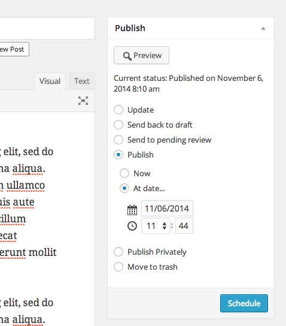

Publish Meta Box 2.0
=

WordPress' publish meta box is a UX obstacle course. This plugin seeks to streamline the workflow.

## Workflow steps

Auto Draft (Unsaved)
	> Save Draft
	> Publish
	> Schedule
	> Trash
	> Delete Permanently
	> Preview

Draft
	> Save Draft
	> Publish
	> Schedule
	> Trash
	> Delete Permanently
	> Preview changes

Scheduled
	> Save
	> Publish now
	> Reschedule
	> Trash
	> Delete Permanently
	> Preview changes

Published
	> Update
	> Unpublish (save as draft)
	> Edit publish date (maybe schedule for future)
	> Trash
	> Delete Permanently
	> Preview changes